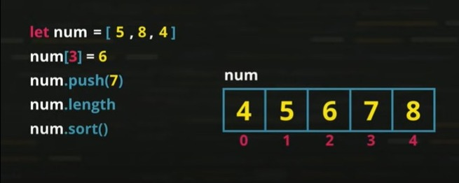

# Curso-de-JS
Curso de JavaScript - Curso em Vídeo

ANOTAÇÕES DO CURSO

Guia de referência Mozilla de JS <br>
https://developer.mozilla.org/pt-BR/docs/Web/JavaScript/Guide

Guia de referência para EVENTOS DOM <br>
https://developer.mozilla.org/en-US/docs/Web/Events

## Anotações gerais

```
var -->> global<br>
let -->> local<br>
const -->> constantes
```
### Tipos de dados

* number
    * infinity
    * NaN
* string
* soolean
* null
* undefined
* object
    * array
* function

### Comentários

// Linha única (JS)

/* comentário de várias linhas */ (CSS e JS)

```
Tanto no HTML quanto no MarkDown as marcações são iguais. 

<!-- Comentário para HTML e MarkDown. Se inicia com <, a exclamação e os dois traços e fecha com dois traços e o sinal de >. Serve para comentar linha única e várias linhas -->
```
### Conversões

CUIDADO: O comando WINDOW.PROMPT trata a entrada como string

Number.parseInt(n) --> Converte string para number inteiro

Number.parseFloat(n) --> converte strint para number flutuante

Number(n) --> JS faz a conversão para number

string(n) --> number para string

n.toString --> converte para string

Template string -->> `${n}` -->> ATENÇÃO: expressão entre CRASES

s.lenght --> mostra o tamanho da string s

s.toUpperCase() --> transforma em maiúsculas a variável s

s.toLowerCase() --> transforma em minúsculas a variável s

n.toFixed(2) --> determina o número de casa decimáis fixas

n.toFixed(2).replace('.', ',') --> determina o número de casa decimáis fixas TROCANDO o ponto por vírgula

n.toLocaleString('pt-BR', {style: 'currency', currency: 'BRL'}) --> coloca o R$

n.toLocaleString('pt-BR', {style: 'currency', currency: 'USD'}) --> coloca o US$

n.toLocaleString('pt-BR', {style: 'currency', currency: 'EUR'}) --> coloca o £

### INCREMENTOS

x = x + 1 --> x += 1 --> x++ (incrementa depois) --> ++x (incrementa antes)

x = x - 1 --> x -=1 --> x-- (decrementa depois) --> --x (decrementa antes)

### OPERADORES RELACIONAIS

```
5 == 5    --> true
5 == '5'  --> true -->> JS NÃO TESTA O TIPO
5 === '5' --> FALSE -->> Operador de identidade
5 === 5   --> true
5 != 4    --> true -->> diferente
5 != '5'  --> false
5 !== '5' --> true -->> não identico
```
### OPERADORES LÓGICOS

!  --> not <br>
&& --> and <br>
|| --> or (barra vertical - pipes)<br>

### OPERADOR TERNÁRIO

teste ? true : false

let media = 7
let condicao
media > 6 ? condicao = 'aprovado' : condicao = 'reprovado'

```
let nota = 8
let res = 0
res = nota % 2 == 0 ? 5 : 7
```

### Condicionantes

```
if (condição) {
    ação
}

if (condição) {
    ação
}
else {
    ação
}

if (condição) {
    ação<br>
} else if (condição) {
    ação
} else if (condição) {
    ação
} else {
    ação
}

switch(expressão) {
    case valor1: 
        ação1
        ação2
        break
    case valor2:
        ação1
        break
    case valor3:
        ação1
        ação2
        ação3
        break
    default:
        ação
}
```

### Laços WHILE

```
>>> TESTA ANTES <<<

while (condição) {
    ação1
    ação2
}

>>> TESTA DEPOIS <<<

do {
    ação1
    ação2
    ação3
} while (condição)

Para FORÇAR A PARADA usa-se o comando >>> break

while (condição) {
    açao1
    ação2
    if (condição) {
        break // a ação3 e 4 não são executadas
    }
    ação3
    ação4
}
```

### Laços FOR

```
for (inicialização; condição; incremento) {
    ação1
    ação2
    ação3
}

for (var c = 1; c <= 6; c++) {
    console.log(`Com for c = ${c}`)
    if (c > 3) {break} // ATENÃO: break tbm funciona para o FOR
}
```

FOR para ARRAY

```
for (variavel in array) {
    ação
}

for (let pos in valores) {
    console.log(`A posição ${pos} tem o valor ${valores[pos]}`)
}
```
### DEBUG

F10 para continuar

### ARRAY



num[3] = 6 >> cria novo elemento e atribui o 6 a ele<br>
num.push(7) >> idem - atribui o 7<br>
num.length >> tamanho do array<br>
num.sort( ) >> ordena o array

num.indexOf(6) >> retorna a posição 2<br>
num.indexOf(3) >> retorna -1 porque não encontrou o valor no array
## Módulo A
01-02-03-04-05-06-07

## Módulo B
08-09-10-11-12

## Módulo C
13-14-15

## Módulo D
16-17-18-19-20-21

## Módulo E
22-23-24(aula do debug)-25-26-27

## Módulo F
28-29-
